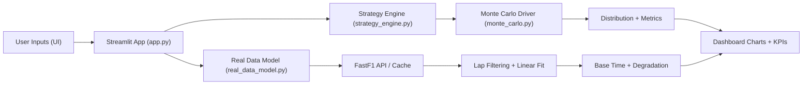
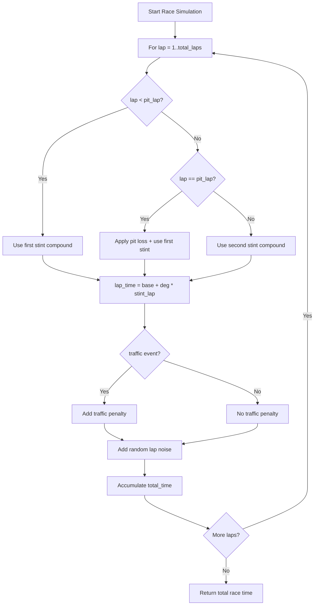
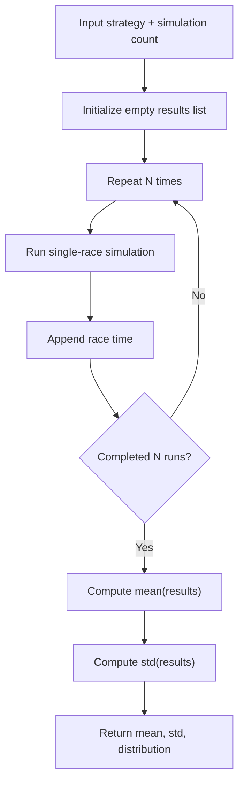
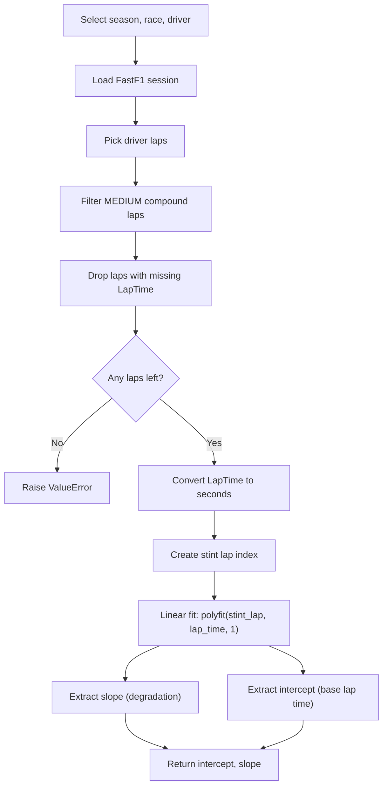

# 🏎️ F1 Strategy Analytics

A race strategy simulation platform inspired by Formula 1 performance engineering.

It combines:
- Interactive strategy exploration in Streamlit
- Monte Carlo simulation for risk-aware race outcomes
- Real race-data tyre degradation modeling using FastF1


## 🚀 Features

### 🖥️ Interactive Dashboard
- Select first and second stint compounds
- Configure pit lap and Monte Carlo run count
- View average race time, risk (standard deviation), and best simulated time
- Inspect full race-time distribution with histogram

### 🧠 Strategy Engine
- Two-stint race model across 60 laps
- Compound-specific base pace and degradation rates
- Pit stop loss modeling
- Stochastic traffic and lap noise integration

### 🎲 Monte Carlo Analysis
- Repeated simulation runs (100 to 2000 from UI)
- Probabilistic distribution of total race time
- Strategy risk profiling with mean and variance metrics

### 📡 Real Data Degradation Model
- FastF1 ingestion with local caching (`fastf1_cache/`)
- Driver lap extraction and filtering by tyre compound
- Linear degradation fitting on Medium compound laps
- Built-in tracks in UI:
  - Monaco GP 2023 (HAM)
  - Silverstone / British GP 2023 (HAM)

## 🧠 Tech Stack

### Application
- Python
- Streamlit

### Analytics
- NumPy
- Pandas
- Matplotlib
- Scikit-Learn

### Data
- FastF1

## 🗂 Folder Structure

```text
f1-strategy-analytics/
│
├── app.py                   # Streamlit dashboard
├── requirements.txt         # Python dependencies
├── src/
│   ├── strategy_engine.py   # Lap-level strategy simulation
│   ├── monte_carlo.py       # Monte Carlo execution logic
│   └── real_data_model.py   # FastF1 degradation fitting
│
├── notebooks/
│   └── exploration.ipynb    # Analysis and experimentation
│
├── fastf1_cache/            # Cached FastF1 responses
└── reports/                 # Optional exported outputs
```

## 🔧 Installation Guide (Everything)

### 1. Prerequisites
- Python 3.10+ (recommended: 3.11)
- `pip`
- `git`

Check versions:

```bash
python --version
pip --version
git --version
```

### 2. Clone the repository

```bash
git clone https://github.com/MacharlaNagamanojreddy/f1-strategy-analytics.git
cd f1-strategy-analytics
```

### 3. Create and activate a virtual environment

#### macOS / Linux

```bash
python -m venv .venv
source .venv/bin/activate
```

#### Windows (PowerShell)

```powershell
python -m venv .venv
.\.venv\Scripts\Activate.ps1
```

#### Windows (CMD)

```cmd
python -m venv .venv
.venv\Scripts\activate.bat
```

### 4. Install dependencies

```bash
python -m pip install --upgrade pip
pip install -r requirements.txt
```

### 5. Run the app

```bash
streamlit run app.py
```

Open:
- `http://localhost:8501`

## ▶️ Usage

### Strategy Simulation
1. Select `First Stint Tire` and `Second Stint Tire`.
2. Set `Pit Lap` and `Monte Carlo Runs`.
3. Click `Run Simulation`.
4. Analyze average time, risk, best time, and distribution chart.

### Real Data Mode
1. Select `Track` as `Monaco` or `Silverstone`.
2. Click `Load Real Data Model`.
3. The model fetches race data, fits degradation, and returns:
   - Estimated base lap time (intercept)
   - Estimated degradation per lap (slope)

## 📈 Algorithm Diagrams

### 1) End-to-End System Flow



### 2) Lap-Time Strategy Simulation Logic



### 3) Monte Carlo Evaluation Flow



### 4) Real Data Degradation Modeling Flow



## 🧮 Core Equations

- Per-lap model:
  - `lap_time = base_compound_time + degradation_rate * stint_lap`
- Total race time:
  - `race_time = sum(all lap_time values) + pit_loss (at pit lap)`
- Monte Carlo outputs:
  - `mean = average(simulated_race_times)`
  - `risk = std(simulated_race_times)`

## 🛠 Troubleshooting

### FastF1 first run is slow
- This is expected for first-time data download.
- Later runs use `fastf1_cache/` and are faster.

### Port already in use
Run Streamlit on a custom port:

```bash
streamlit run app.py --server.port 8502
```

### Dependency issues
Rebuild virtual environment:

```bash
rm -rf .venv
python -m venv .venv
source .venv/bin/activate
pip install -r requirements.txt
```

## 👨‍💻 Author

Macharla Naga Manoj Reddy  
F1 Strategy Analytics - Prototype Release

If this project was useful, please ⭐ the repo.
